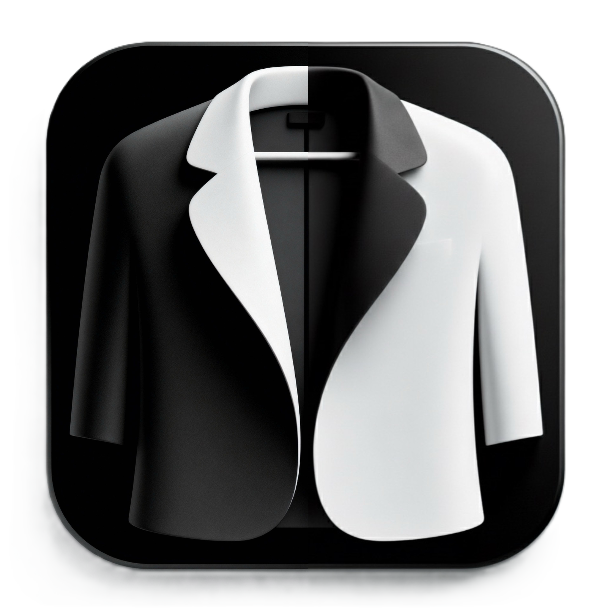

# OBRAZZ Landing Page

<p align="center">
  
</p>

<p align="center">
  <strong>AI-powered персональный гардероб</strong>
</p>

<p align="center">
  <a href="#о-проекте">О проекте</a> •
  <a href="#технологии">Технологии</a> •
  <a href="#установка">Установка</a> •
  <a href="#разработка">Разработка</a> •
  <a href="#сборка">Сборка</a> •
  <a href="#документация">Документация</a>
</p>

---

## О проекте

**OBRAZZ** — это минималистичная одностраничная лендинг-страница для iOS мобильного приложения OBRAZZ — AI-помощника для персонального гардероба.

### Что такое OBRAZZ?

OBRAZZ — это мобильное приложение, которое сочетает в себе:
- 📱 **Цифровой гардероб** — каталог всех ваших вещей
- 🎨 **Визуальный конструктор образов** — Drag & Drop редактор для создания луков
- 🤖 **AI-стилист** — умные подборки образов под ваш стиль и сезон
- 🌐 **Социальная лента** — вдохновение от других пользователей

### Особенности лендинга

- ⚡ Молниеносная загрузка благодаря Vite
- 🎭 Плавные анимации с Framer Motion
- 📱 Полностью адаптивный дизайн (mobile-first)
- 🍎 iOS-inspired минималистичный дизайн
- 🌓 Поддержка светлой и тёмной темы
- ♿ Accessibility-friendly компоненты

## Технологии

### Frontend
| Технология | Описание |
|------------|----------|
| [React 18](https://react.dev/) | UI библиотека |
| [TypeScript](https://www.typescriptlang.org/) | Типизация |
| [Vite](https://vitejs.dev/) | Сборщик |
| [Tailwind CSS](https://tailwindcss.com/) | Утилитарный CSS |
| [Framer Motion](https://www.framer.com/motion/) | Анимации |
| [Shadcn/ui](https://ui.shadcn.com/) | UI компоненты |
| [Wouter](https://github.com/molefrog/wouter) | Роутинг |
| [TanStack Query](https://tanstack.com/query) | Управление состоянием |

### Backend
| Технология | Описание |
|------------|----------|
| [Express.js](https://expressjs.com/) | Web-сервер |
| [Drizzle ORM](https://orm.drizzle.team/) | ORM для PostgreSQL |
| [Neon](https://neon.tech/) | Serverless PostgreSQL |

## Установка

### Требования

- Node.js 18+
- npm 9+

### Шаги

```bash
# Клонирование репозитория
git clone https://github.com/your-username/obrazz-landing.git
cd obrazz-landing

# Установка зависимостей
npm install

# Запуск в режиме разработки
npm run dev
```

Приложение будет доступно на `http://localhost:5000`

## Разработка

### Доступные команды

| Команда | Описание |
|---------|----------|
| `npm run dev` | Запуск dev-сервера |
| `npm run build` | Production сборка |
| `npm run start` | Запуск production сервера |
| `npm run check` | Проверка TypeScript |
| `npm run db:push` | Применить схему к БД |

### Структура проекта

```
LandingPageObrazz/
├── client/                 # Frontend приложение
│   ├── src/
│   │   ├── components/     # React компоненты
│   │   │   ├── landing/    # Секции лендинга
│   │   │   └── ui/         # Shadcn/ui компоненты
│   │   ├── pages/          # Страницы
│   │   ├── hooks/          # Custom хуки
│   │   └── lib/            # Утилиты
│   └── public/             # Статические файлы
├── server/                 # Backend приложение
├── shared/                 # Общий код (схемы)
├── Docs/                   # Документация
└── script/                 # Build скрипты
```

Подробнее о структуре: [Docs/PROJECT_STRUCTURE.md](./Docs/PROJECT_STRUCTURE.md)

## Сборка

### Production сборка

```bash
# Сборка клиента и сервера
npm run build

# Запуск production версии
npm run start
```

### Docker (опционально)

```bash
# Сборка образа
docker build -t obrazz-landing .

# Запуск контейнера
docker run -p 5000:5000 obrazz-landing
```

## Секции лендинга

Лендинг состоит из 9 секций:

1. **Hero** — Главный экран с логотипом и iPhone mockup
2. **Problem/Solution** — Проблемы и решение
3. **App Demo** — Демонстрация приложения
4. **Benefits** — Преимущества продукта
5. **How It Works** — Как это работает
6. **Social Feed** — Социальная лента
7. **Pricing** — Тарифы
8. **CTA** — Призыв к действию
9. **Footer** — Подвал

## Документация

- [Структура проекта](./Docs/PROJECT_STRUCTURE.md)
- [Архитектура](./Docs/ARCHITECTURE.md)
- [Компоненты](./Docs/COMPONENTS.md)
- [API](./Docs/API.md)
- [Разработка](./Docs/DEVELOPMENT.md)
- [Деплой](./Docs/DEPLOYMENT.md)

## Дизайн

Дизайн следует iOS Human Interface Guidelines:

- **Цвета**: Чёрно-белая палитра (#000000, #FFFFFF, оттенки серого)
- **Типографика**: Inter (SF Pro-like)
- **Отступы**: Большие секционные отступы (128-160px)
- **Скругления**: iOS-style (20-26px)

Подробнее: [design_guidelines.md](./design_guidelines.md)

## Лицензия

MIT © OBRAZZ Team

---

<p align="center">
  Сделано с ❤️ командой OBRAZZ
</p>
